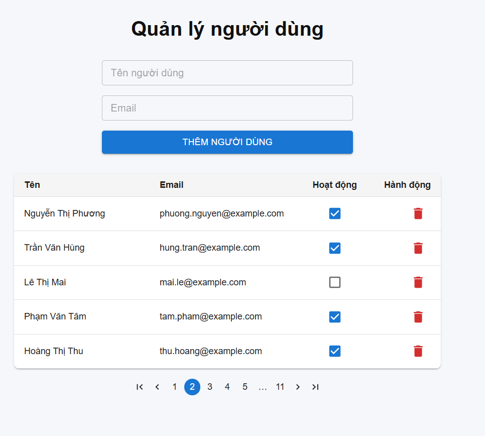
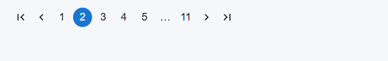
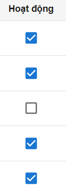
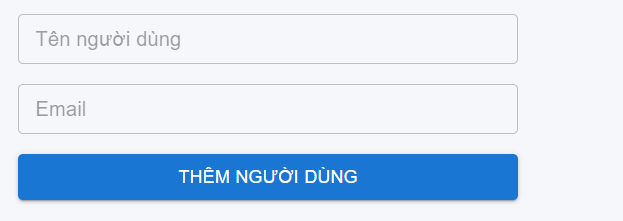
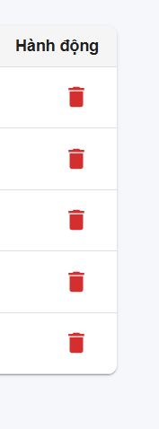

# Quản lý người dùng

Ứng dụng **Quản lý người dùng** cho phép thêm, xóa và quản lý trạng thái hoạt động của người dùng một cách trực quan và dễ sử dụng.  

## 📌 Chức năng chính

### 1. Thêm người dùng
- Nhập **Tên người dùng** và **Email** vào form phía trên.
- Nhấn nút **"THÊM NGƯỜI DÙNG"** để thêm mới vào danh sách.

### 2. Danh sách người dùng
- Danh sách hiển thị các thông tin:
  - **Tên**: Họ tên đầy đủ.
  - **Email**: Địa chỉ email.
  - **Hoạt động**: Checkbox để bật/tắt trạng thái hoạt động.
  - **Hành động**: Nút thùng rác màu đỏ để xóa người dùng.

### 3. Trạng thái hoạt động
- Checkbox trong cột **Hoạt động** hiển thị tình trạng:
  - ✅ Đang hoạt động.
  - ⬜ Không hoạt động.
- Có thể thay đổi trực tiếp ngay trên bảng.

### 4. Xóa người dùng
- Nhấn biểu tượng thùng rác màu đỏ để xóa một người dùng khỏi danh sách.

### 5. Phân trang
- Hỗ trợ **phân trang** ở cuối bảng:
  - Chuyển trang trước/sau.
  - Nhảy về trang đầu/cuối.
  - Chọn số trang cụ thể.  
- Mỗi trang hiển thị 5 người dùng.

## 📷 Minh họa giao diện

### Form thêm và danh sách người dùng

### Phân trang

### Cột hoạt động & hành động

### Form thêm người dùng

### Nút xóa người dùng

